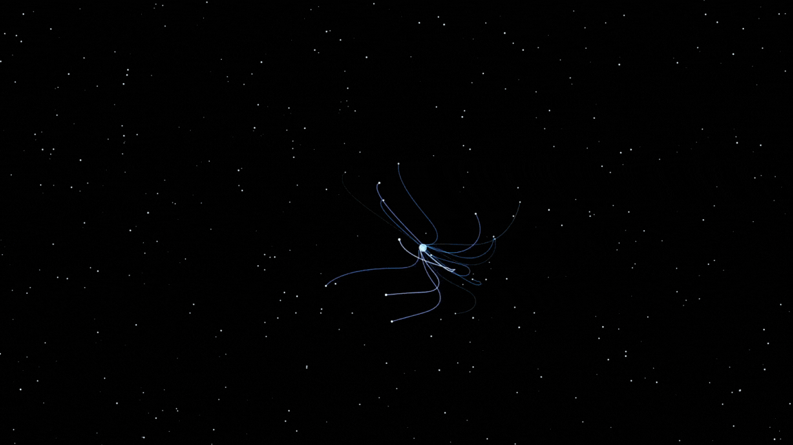

# Projeto: Sozinho

Uma entidade vagando pelos cosmos sózinha.

# Sobre o projeto

Este projeto é um experimento de animação interativa feito com HTML5 Canvas e JavaScript. Ele cria um efeito visual de tentáculos que seguem o movimento do cursor do mouse. O código cria um cenário com estrelas e um conjunto de tentáculos que respondem ao movimento do mouse.

## Prévia

# Tecnologias utilizadas

- HTML / CSS / JS
- Canvas

# Autor

R. Gonçalves
https://www.linkedin.com/in/rgonsa/
